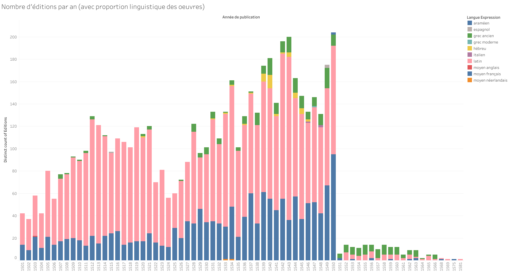
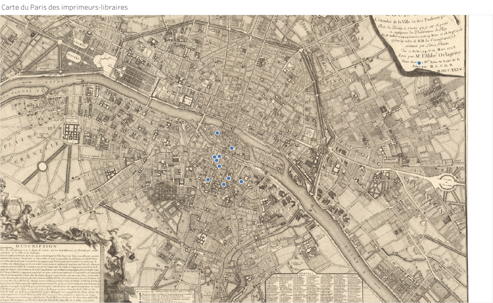
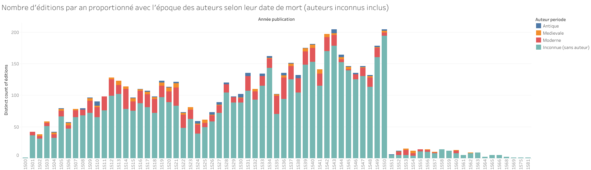
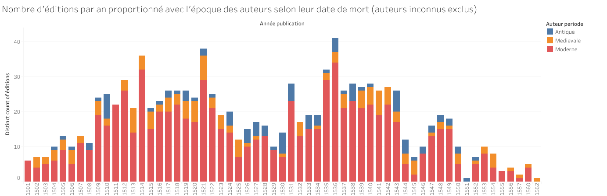
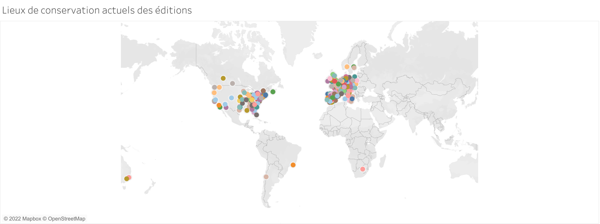
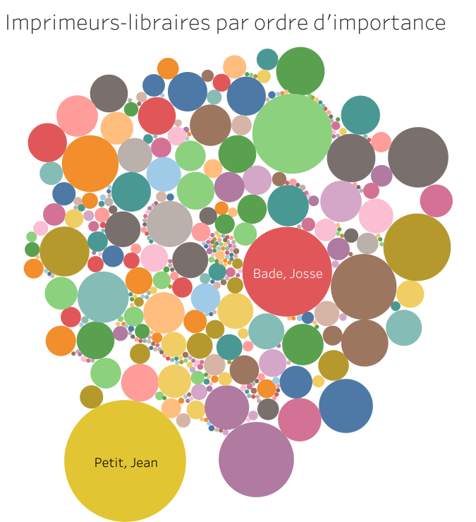

BP16-plus
===

# Présentation générale du projet
A partir du dump BP16, nous avons constitué un jeu de données relatifs aux éditions, leurs exemplaires, leurs auteurs, leurs libraires (chaque édition possède donc des doublons lorsqu'elle a plusieurs auteurs, plusieurs libraires ou plusieurs exemplaires) afin de procéder à des enrichissements sur :
1. Les exemplaires : enrichir leurs lieux de conservation par des données de géolocalisation les lieux à partir de Wikidata ;
2. Les auteurs : rapatrier des données biographiques (nom et dates) à partir de data.bnf.fr ;
3. Les imprimeurs-libraires : rapatrier des données biographiques et leurs adresses d'activité à partir du [CERL Thesaurus](https://data.cerl.org/thesaurus/_search).

# Recrutement du corpus de départ
## La sélection des données du dump BP16
Nous avons monté le dump BP16 dans une base en graphe et recherché par une requête Sparql les attributs suivants :
- `?uriManif` : l'URI de chaque édition ("manifestation" en modèle FRBF) 
- `?identifiantBP16` : l'identifiant de chaque notice d'édition
- `?titre` : le titre de l'édition
- `?auteur` : le lien vers la notice Data-BNF d'un éventuel auteur 
- `?editeur` : le lien vers la notice Data-BNF d'un éventuel éditeur (éditeur du texte)
- `?lieuPublication` : le lieu de publication (toujours Paris en principe, mais je voulais vérifier)
- `?publisher` : le label sous lequel l'édition est publiée (imprimeur-libraire)
- `?date` : la date de publication
- `?imprLibraire` : le lien vers la notice Data-BNF d'un imprimeur-libraire
- `?catalogueBNF` : le lien vers la notice du catalogue de la BNF de l'édition
- `?uriItem` : l'URI de chaque examplaire d'une édition ("item" en modèle FRBF) 
- `?localisation` : le lieu de conservation de l'exemplaire

## La requête Sparql
```sql
PREFIX rdf: <http://www.w3.org/1999/02/22-rdf-syntax-ns#>
PREFIX ns2: <http://rdvocab.info/RDARelationshipsWEMI/>
PREFIX ns3: <http://rdvocab.info/roles/>
PREFIX ns1: <http://data.bnf.fr/ontology/bnf-onto/>
PREFIX ns6: <http://purl.org/dc/terms/>
PREFIX rdfs: <http://www.w3.org/2000/01/rdf-schema#>
PREFIX ns4: <http://RDVocab.info/Elements/>
PREFIX ns5: <http://data.bnf.fr/vocabulary/roles/>
SELECT DISTINCT ?uriManif ?identifiantBP16 ?titre ?auteur ?editeur ?lieuPublication ?publisher ?date ?imprLibraire ?catalogueBNF ?uriItem ?localisation
WHERE { 
  ?uriManif ns1:identifiantBP16 ?identifiantBP16. 
  ?uriManif ns6:title ?titre.
  ?uriManif rdfs:seeAlso ?catalogueBNF.
  ?uriManif ns4:dateOfPublication ?date.
  ?uriManif ns4:placeOfPublication ?lieuPublication.
  ?uriManif ns5:r3260 ?imprLibraire.
  ?uriItem ns2:manifestationExemplified ?uriManif.
  ?uriItem ns3:currentOwnerItem ?localisation.
  OPTIONAL {
      ?uriManif ns5:r70 ?auteur.
      ?uriManif ns5:r360 ?editeur.
      ?uriManif ns4:publishersName ?publisher.
    }
}
```

## Données récoltées
Le résultat de la requête a été intégré au projet sous le nom `bp16-export-primaire`.

# Nettoyage du jeu primaire
## Dates
Les dates ont été traitées à partir de la donnée brute renseignée sous l'attribut **Date publication complète**. Les champs **Date publication ISO** résultent de la transformation de ces données selon la norme ISO-8601.

Cas particuliers :
- Lorsque la **Date publication complète** contient une information issue d'une analyse (elle figure entre crochets), c'est cette dernière valeur qui a été retenu pour renseigner l'attribut **date ISO**.
- Lorsque la **Date publication complète** décrit un intervalle, la limite basse a été renseignée selon le même format que **date ISO** sous l'attribut **Date publication ISO jusqua**

## Les lieux de conservation
Les lieux de conservation des éditions se présentaient sous la forme suivante "Ville, institution de conservation (pays ou région)(informations sur les exemplaires)(état de l'exemplaire)" dans la colonne `?localisation`. A l'aide d'expressions régulières, les données ont été séparées en quatre colonnes, `Ville conservation item`, `Institution de conservation item`, `Informations item` et `Etat item`, qui permettent de bien distinguer les informations qui étaient contenues dans une même colonne. Les informations sur les pays ou régions (voire départements), trop irrégulières, n'ont pas été conservées. Ce nettoyage des données a aussi permis, plus tard, un enrichissement du jeu de données à l'aide des colonnes `Ville conservation item` et `Institution conservation item`.

# Enrichissements
## La langue des ouvrages
On a récupéré les langues des **expressions** dont le dump BP16 contient les **manifestations** (modèle FRBR).

1. On a d'abord récupéré l'URI DataBNF de l'expression à partir de son URI BP16 ;

2. Puis requêté l'URI de l'expression au moyen d'une requête sparql sur DataBNF afin de requêter la langue de cette expression ; on a procédé à ces requêtes au moyen du script python `compute_bp16-langExp` qui a effectué pour chaque ligne une requête du type :
    ```sql
    SELECT DISTINCT ?langue
    WHERE {
        <http://data.bnf.fr/ark:/12148/cb418775742#about> <http://rdvocab.info/RDARelationshipsWEMI/expressionManifested> ?uriexpression.
        ?uriexpression <http://purl.org/dc/terms/language> ?langue.
    } LIMIT 1
    ```
    Le résultat est dans le jeu `bp16-langExp`.

3. On a enfin traduit les URI ISO des langues en données parlantes : résultat dans le jeu `bp16-langNorm`.

## Les adresses bibliographiques
Pour les imprimeurs-libaires, notre jeu de données primaire contenait les URI de leurs notices DataBNF, dont il était alors possible de comparer l'identifiant **ark**, avec celui contenu dans les notices du [CERL Thesaurus](https://data.cerl.org/thesaurus/_search).

### Constitution du jeu secondaire "cerl-imprim-paris"
- Source mobilisée : [CERL Thesaurus](https://data.cerl.org/thesaurus/_search).
- Nom du jeu secondaire : `cerl-imprim-paris`
- Définition : export de toutes les **personnes** de CERL répondant à "imprimeur" et "Paris" (4557). Les notices du CERL les plus pertinentes sont en effet de type `cnp` ("personnes") : plus riches en information, elles renseignent notamment le type d'activité.
- Méthode d'acquisition : liste des requêtes pour chaque 100 résultats dans `./requetes/cerl-imprim-paris.text`. 
- Exemples de requête : 
    - https://data.cerl.org/thesaurus/_search?query=(imprimeur%20paris)%20AND%20type%3Acnp&size=100&mode=default&format=json&from=1
    - https://data.cerl.org/thesaurus/_search?query=(imprimeur%20paris)%20AND%20type%3Acnp&size=100&mode=default&format=json&from=101
    - https://data.cerl.org/thesaurus/_search?query=(imprimeur%20paris)%20AND%20type%3Acnp&size=100&mode=default&format=json&from=201

### Traitements
#### Ciblage des résultats pertinents
On a éliminé la majorité des lignes non pertinentes en appliquant un *filter* sur l'attribut `additional_display_line`, *contains* 15 : ce champ commence par les dates ; poser que le champ contient 15 élimine de nombreux imprimeurs qui n'ont pas 15 dans leur date de naissance ou de mort, et qui n'ont donc pas été actifs au XVIe siècle.

On a obtenu le set `cerl-imprim-paris_filtered` (env. 1000 lignes au lieu de 4500).

#### Récupération des données issues des notices
On a récupérer au moyen d'un script python (`compute_cerl-imprim-paris-enrich.py`) les données intéressantes dans la notice de chaque imprimeur à partir de l'`id` de type `cnp` contenu dans le jeu précédent.

La récupération de chaque notice s'est faite par une requête de type `https://data.cerl.org/thesaurus/cnp01118364?format=json&pretty`. On a ensuite parsé le contenu de chaque Json pour récupérer le numéro ark (qui pouvait être précédé soit d'une adresse data.bnf.fr soit d'une adresse catalogue.bnf.fr.

Chaque notice peut comporter jusqu'à 950 attributs. On a donc procédé à un parsage des données au moyen du script pour ne récupérer que celles répondant à certains conditions restreintes.

On a obtenu le jeu `cerl-imprim-paris-enrich`.

#### Nettoyage des données relatives aux adresses bibliographiques
A partir du jeu obtenu, on a effectué un ensemble de traitements à base d'expressions régulières, pour générer une colonne "adresse simplifiée".

On a obtenu le jeu `cerl-imprim-paris-rues`.

## Constitution du jeu secondaire wikidata-rues-paris
Il fallait ensuite croiser les noms de rues nettoyé avec une source fournissant des informations de géolocalisation.

- Source mobilisée : Wikidata.
- Nom du jeu : `wikidata-rues-paris`
- Définition : export de données liées répondant à la description `"street in Paris, France"@en`, plus riche que son homologue francophone.
- Méthode d'acquisition : on a récupéré de Wikidata une liste des noms des rues de Paris avec leurs coordonnées en passant deux requêtes HTTP successives exprimant deux requêtes Sparql (voir *infra*).

### Jeu de données concurrent écarté
Nous avons également examiné le jeu de données [Dénominations des emprises des voies actuelles](https://opendata.paris.fr/explore/dataset/denominations-emprises-voies-actuelles/export/?disjunctive.siecle&disjunctive.statut&disjunctive.typvoie&disjunctive.arrdt&disjunctive.quartier&disjunctive.feuille&sort=historique) disponible sur opendata.paris.fr.

Malheureusement, les informations relatives aux anciens noms de rues y sont contenues dans un champ "historique" touffu (un long paragraphe), dont il n'a pas été possible d'extraire de façon satisfaisante les seuls noms des rues.

### Méthode d'acquisition détaillée
1. Avec le nom principal de l'entité :
    ```sql
    SELECT ?entite ?nom ?coordonnees
    WHERE {
        ?entite schema:description "street in Paris, France"@en.
        ?entite rdfs:label ?nom.
        ?entite p:P625 ?proprieteLoc.
        ?proprieteLoc ps:P625 ?coordonnees.
    }
    ```
2. Avec les noms autres :
    ```sql
    SELECT ?entite ?nom ?coordonnees
    WHERE {
        ?entite schema:description "street in Paris, France"@en.
        ?entite skos:altLabel ?nom.
        ?entite p:P625 ?proprieteLoc.
        ?proprieteLoc ps:P625 ?coordonnees.
    }
    ```
Requêtes HTTP :
- https://query.wikidata.org/sparql?format=json&query=SELECT%20%3Fentite%20%3Fnom%20%3Fcoordonnees%0A%20%20%20%20WHERE%20%7B%0A%20%20%20%20%20%20%20%20%3Fentite%20schema%3Adescription%20%22street%20in%20Paris%2C%20France%22%40en.%0A%20%20%20%20%20%20%20%20%3Fentite%20rdfs%3Alabel%20%3Fnom.%0A%20%20%20%20%20%20%20%20%3Fentite%20p%3AP625%20%3FproprieteLoc.%0A%20%20%20%20%20%20%20%20%3FproprieteLoc%20ps%3AP625%20%3Fcoordonnees.%0A%20%20%20%20%7D
- https://query.wikidata.org/sparql?format=json&query=SELECT%20%3Fentite%20%3Fnom%20%3Fcoordonnees%0A%20%20%20%20WHERE%20%7B%0A%20%20%20%20%20%20%20%20%3Fentite%20schema%3Adescription%20%22street%20in%20Paris%2C%20France%22%40en.%0A%20%20%20%20%20%20%20%20%3Fentite%20skos%3AaltLabel%20%3Fnom.%0A%20%20%20%20%20%20%20%20%3Fentite%20p%3AP625%20%3FproprieteLoc.%0A%20%20%20%20%20%20%20%20%3FproprieteLoc%20ps%3AP625%20%3Fcoordonnees.%0A%20%20%20%20%7D

Après obtention des résultats, on a nettoyé les valeurs avec une recette d'expression régulières et conservé uniquement le label français des rues.

### Bilan de la jointure avec le jeu de données principal
De nombreuses adresses bibliographiques n'ont pas trouvé de correspondance suite à la jointure de ces données avec celles issues du CERL. Les anciens noms des rues de Paris sont peu renseignés dans les entités de Wikidata, et nettoyer parfaitement les adresses bibliographiques issues du Thesaurus CERL aurait demandé un effort considérable. Mais il était intéressant d'effectuer cet enrichissement, bien que la complétude des données soit limitée.

## Les coordonnées géographiques des bibliothèques conservant les exemplaires
Après le nettoyage des données relatives aux lieux de conservation des exemplaires, nous avons procédé pour chacun, via un script python à la recherche des coordonnées géographiques de ces lieux sur Wikidata. Voici un exemple de requête sparql :
```sql
PREFIX rdfs: <http://www.w3.org/2000/01/rdf-schema#>
PREFIX wdt: <http://www.wikidata.org/prop/direct/>
PREFIX p: <http://www.wikidata.org/prop/>
PREFIX ps: <http://www.wikidata.org/prop/statement/>
SELECT DISTINCT ?entiteInstitution ?coordonnees
WHERE {
  ?entiteInstitution rdfs:label ?nomInstitution.
  ?entiteInstitution wdt:P131 ?entiteLieu.
  ?entiteLieu wdt:P1705 ?nomLieu.
  ?entiteInstitution p:P625 ?proprieteLoc.
  ?proprieteLoc ps:P625 ?coordonnees.
  filter contains(?nomLieu, "London")
  filter contains(lcase(?nomInstitution), "british")
  filter contains(lcase(?nomInstitution), "library")
}
LIMIT 1
```

En raison de la longueur du traitement pour chaque institution distincte, le serveur de Dataiku a refusé d'effectuer ce travail jusqu'au bout. Nous avons par conséquent effectué ce travail en dehors de Dataiku au moyen de [ce script python](py/enrich-loc.py), puis intégré le fichier CSV des résultats au projet sous le nom `lieux_conservation_enrichComplet`.

## Identification des auteurs des oeuvres
### Noms et prénoms, date de naissance et de mort
Afin de récupérer les noms et prénoms, dates de naissance et de mort des **auteurs**, nous avons procédé à différentes étapes, en nous basant sur le script python précédemment réalisé pour récupérer les **langues** des oeuvres.

1. On a d'abord récupéré l'URI DataBNF de l'expression à partir de son URI auteur ;

2. Puis requêté l'URI au moyen d'une requête sparql sur DataBNF afin de récupérer le nom, prénom, nom complet s'il existe, date de naissance et de mort de cette expression ; on a procédé à ces requêtes au moyen du [script python](py/dates-auteurs) visible dans la recette `compute_bp16-nomsAuteurs` qui a effectué pour chaque ligne une requête du type :
    ```sql
    SELECT DISTINCT ?nom ?nomComplet ?naissance ?mort
         WHERE {
         <''' + uriDataAuteur + '''> <http://xmlns.com/foaf/0.1/familyName> ?nom.
         <''' + uriDataAuteur + '''> <http://xmlns.com/foaf/0.1/name> ?nomComplet.
         <''' + uriDataAuteur + '''> <http://vocab.org/bio/0.1/birth> ?naissance.
         <''' + uriDataAuteur + '''> <http://vocab.org/bio/0.1/death> ?mort
         } LIMIT 1
    ```
    Le résultat est dans le jeu `bp16-nomsAuteurs`.
    
### Nettoyage des données
Un travail de normalisation sous forme ISO des dates récupérées était essentiel. En effet ces dernières se présentaient sous des formes variées, allant de 2 à 8 chiffres, certaines affichant des jours et mois particuliers (ex: 1469-02-20) , d'autres (notamment pour les auteurs fictifs) présentaient des données incomplètes signalées par des points de ponctuation (ex: 14..). Une petite dizaine de dates présentaient un tiret (ex: -0100-07-12) renseigné pour les auteurs antiques d'avant JC. Pour finir, les auteurs non renseignés pour certaines oeuvres renvoyaient NULL concernant leur dates.
1. De nombreuses Regex (ex: ^(\d\d)(\.\.)$ -> $100-01-01) ont été utilisées pour rendre toutes ces dates conformes au format ISO.
2. L'ensemble des regex utilisées pour ce nettoyage est disponible dans la recette du jeu `compute_bp16-loc_net_datesNaissMort_net`

### Concernant les périodes historiques des auteurs
Une colonne **periode auteur** a été ajoutée afin de trier les auteurs selon leur période historique. De manière conventionnelle il a été retenu de se baser sur leur **date de mort**. Les tranches de dates choisies pour délimiter les périodes sont les suivantes:
* Antique : avant JC à 500 inclu
* Médiévale : de 501 à 1449
* Moderne : a partir de 1450

# Visualisations
## Langues des éditions


La visualisation [BP16 plus Langue oeuvres](https://public.tableau.com/app/profile/s.bastien.biay/viz/BP16plusLangueoeuvres/Feuille1) présente un déploiement, sur toute l'amplitude chronologique du XVIe siècle, du nombre d'éditions mises en circulations, et comptabilise parmi celles-ci le nombre d'éditions publiées dans chacune des langues attestées parmi nos données.

Cette visualisation fait clairement apparaître plusieurs phénomènes :
- Le manque de données sur les éditions postérieures à 1550 ;
- La croissance relativement continue du nombre d'éditions par an ;
- L'accroissement des éditions en langue française (bleu), dont la proportion est quasiment équivalente à l'édition d'ouvrages en langue latine (rose) en 1550 ;
- L'apparition d'éditions dans les langues anciennes autre que le latin (édition scientifique) à partir de 1530 environ (hébreu et grec ancien principalement, respectivement en jaune et vert).

## Le Paris des imprimeurs-libraires


La visualisation [BP16 plus Carte imprimeurs-libraires](https://public.tableau.com/app/profile/s.bastien.biay/viz/BP16plusCarteimprimeurs-libraires/Feuille2) restitue sur la carte du Paris ancien (il s'agit de la carte de l'Abbé Delagrive, du début du XVIIIe siècle) les coordonnées géographiques des rues qui ont pu être croisées avec succès avec les adresses des imprimeurs-libraires. Chaque point correspond à la notice Wikidata d'une rue de Paris et précise le nombre d'imprimeurs-libraires rattachés à cette adresse. Le Quartier-Latin et l'Ile de la Cité se distinguent naturellement sur la carte, avec la rue Saint-Jacques, la rue Neuve Notre-Dame et le Palais comme lieu totalisant le plus grand nombre d'enseignes de librairie.

## Auteurs selon périodes
### Auteurs inconnus pris en compte


La visualisation [BP16 plus periodes oeuvres](https://public.tableau.com/app/profile/falcoz/viz/BP16plusperiodesoeuvres/Feuille1) établit le nombre d'éditions par années en y faisant figurer la proportion des auteurs représentés selon leur période historique (antique, médiévale et moderne) en se basant sur leur date de mort. Dans cette première version de visualisation, nous prenons en compte les oeuvres dont les auteurs sont inconnus. On remarque à propos que ces derniers représentent, entre 1500 et 1550, la très grande majorité, allant pour certaines années jusqu'à plus de 80% des oeuvres. Le reste des ouvrages représentent en majorité des auteurs de l'époque moderne, puis en quantité beaucoup plus faible des auteurs médiévaux, certaines années (comme 1511 ou 1528) n'en contenant même aucun. Les auteurs antiques quant à eux, surprenamment, constituent la partie la plus faible en proportions et sont absents dans 40% des années. On remarque en deuxième lieu qu'à partir des années 1550, le nombre de publications s'effondre, passant de plus de 200 à une petite dizaine, comme cela était visible dans la visualisation `BP16 plus Langue oeuvres`.

### Auteurs inconnus non pris en compte


La visualisation [BP16 plus periodes oeuvres 2](https://public.tableau.com/app/profile/falcoz/viz/BP16plusperiodesoeuvres2/Feuille2) est une sorte de "zoom" de la visualisation précédente permettant de mieux se rendre compte de la représentation des périodes par années, sans être encombrés par la donnée des oeuvres aux auteurs inconnus. L'écart entre la quasi absence des auteurs antiques et la grande prédominance des ouvrages d'auteurs d'époque moderne est d'autant plus visible.

## Localisation actuelle des éditions


La visualisation [BP16 Lieux Conservation](https://public.tableau.com/app/profile/zcappe/viz/LieuxConservation/Feuille1) permet de repérer la localisation actuelle de toutes les éditions répertoriées dans le BP16, grâce aux coordonnées géographiques qui ont été trouvées pour chaque institution de conservation. On remarque une répartition très importante des ouvrages à travers le monde, en particulier en Europe et aux Etats-Unis. Une visualisation comme celle-ci donne une idée de l'importance de la circulation des ouvrages à travers le temps, et peut permettre aux chercheurs de localiser plus rapidement les éditions afin, par exemple, de pouvoir les consulter.


## Imprimeurs-libraires par ordre d'importance


La visualisation [BP16 Imprimeurs-Libraires](https://public.tableau.com/app/profile/zcappe/viz/BP16ImprimeursLibraires/Feuille3) nous donne une idée de l'importance des imprimeurs-libaires du XVIe siècle à Paris en fonction de leur nombre d'éditions. On peut aussi remarquer les limites des données, qui répète un certain nombre de fois les mêmes imprimeurs libraires qui se sont associés pour réaliser certaines éditions, et dont nous n'avons pas pu séparer les noms sans dénaturer la valeur de ces données, ce qui fausse le calcul. Néanmoins, les noms des  imprimeurs-libraires qui ressortent le plus, comme Jean Petit, Josse Bade ou Robert Estienne, sont tout à fait cohérents avec leur importance en tant qu'imprimeurs-libraires à l'époque, et les données sont donc valables malgré les quelques cas particuliers.
